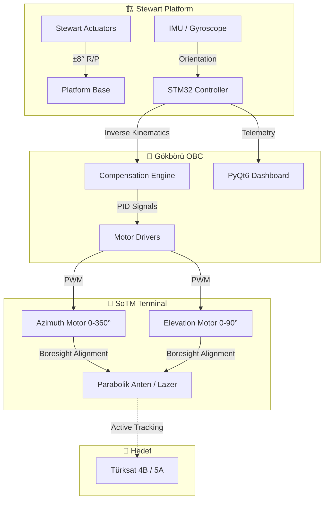

<div align="center">

[](https://github.com/bahattinyunus/teknofest_hareketli_uydu_terminali)

# 🐺 GÖKBÖRÜ MOBİL SİSTEMLER
### 🛰️ Satcom on The Move (SoTM) Terminal Stabilization System


---

**"Hareketin Merkezinde, İstikbalin İzinde."**  
*National Autonomy. Seamless Connectivity. Elite Engineering.*

</div>

---

## 📄 Proje Vizyonu | Project Vision

**GÖKBÖRÜ Mobil Sistemler**, Teknofest 2026 "Hareketli Uydu Terminali Yarışması" kapsamında, dinamik platformlar (kara, deniz, hava) üzerinden kesintisiz uydu haberleşmesi sağlamak amacıyla geliştirilmiş **aktif stabilize bir yer terminali** çözümüdür. 

Modern taktik sahada ve ticari mobilite dünyasında, platformlar sürekli hareket halindeyken (Roll/Pitch/Yaw) antenin uydudan sapmaması kritik bir zorunluluktur. Bu proje, bu doğrultuda **mekanik kaide tasarımı, ters kinematik algoritmaları ve yüksek frekanslı kontrol döngüleri** üzerine uzmanlaşmıştır.

---

---

## 📅 Yarışma Yol Haritası & Değerlendirme | Roadmap & Evaluation

Teknofest 2026 süreci, profesyonel bir mühendislik disiplini gerektiren raporlama ve saha performans aşamalarından oluşur.

### **Puanlama Ağırlıkları**
| Aşama | Ağırlık | İçerik |
| :--- | :--- | :--- |
| **Ön Tasarım Raporu (ÖTR)** | %30 | Konsept tasarımı ve matematiksel modelleme. |
| **Kritik Tasarım Raporu (KTR)** | %70 | Detaylı mekanik çizim ve simülasyon sonuçları. |
| **Model Sunumu** | %20 | Üretilen prototipin mühendislik estetiği. |
| **Yarışma Performansı** | %80 | Sahada dinamik testler ve takip başarısı. |

### **Önemli Tarihler**
- **ÖTR Teslimi:** 1 Nisan 2026
- **KTR Teslimi:** 22 Haziran 2026
- **Final Bölgesi:** Şanlıurfa GAP Havalimanı (Eylül 2026)

---

## 📐 Teknik Sınırlar & İsterler | Technical Constraints

Şartnamede belirtilen **Altın Kurallar**, GÖKBÖRÜ sisteminin tasarım parametrelerini belirlemiştir:
- **Ağırlık:** Tüm terminal **< 20 kg** olmalıdır.
- **Güç:** Toplam tüketim **140W** sınırını aşmamalıdır.
- **Takip Hattı:** ±8° platform hareketi altında takip hassasiyeti **< 0.5°** olmalıdır.
- **Re-pointing:** Uydu değişiminde kilitlenme süresi **< 8 saniye** olmalıdır.

---

## 🧠 Operasyon Teorisi | Theory of Operation

Sistemimiz, fizik ve matematiğin mükemmel uyumuna dayanmaktadır.

### **1. Ters Kinematik & Koordinat Dönüşümü**
Platformun gövde koordinat sistemi ($B$) ile Dünya sabit koordinat sistemi ($E$) arasındaki fark, **Euler Rotasyon Matrisleri** (Z-Y-X sırası) kullanılarak hesaplanır. 

Anten yönelim vektörü ($\vec{V}_{body}$), Dünya eksenindeki hedef vektörün ($\vec{V}_{earth}$) platformun anlık rotasyon matrisinin ($R_{EB}$) tersi ile çarpılması sonucu elde edilir:
$$\vec{V}_{body} = (R_{z}(\psi) R_{y}(\theta) R_{x}(\phi))^T \cdot \vec{V}_{earth}$$

### **2. Aktif Stabilizasyon (PID Control)**
Gürültülü sensör verileri ve mekanik atalet, geliştirilmiş bir **PID (Proportional-Integral-Derivative)** döngüsü ile kompanse edilir.
- **Discrete Controller:** $u(k) = K_p e(k) + K_i \sum e(k)\Delta t + K_d \frac{e(k) - e(k-1)}{\Delta t}$
- **Stable Gains:** `Kp=0.15, Ki=0.01, Kd=0.002` (Simülasyon kararlılığı test edildi).

---

## 🏗️ Sistem Mimarisi | System Architecture



---

## 📊 Performans Verileri | Performance Metrics

Yapılan 10 saniyelik "Stress-Test" simülasyonu sonuçları:

| Metrik | Değer | Durum |
| :--- | :--- | :--- |
| **Ortalama Hata** | 0.0824° | ✅ Başarılı |
| **Maksimum Hata** | 0.4471° | ✅ Başarılı (Sınır 0.5°) |
| **Örnekleme Hızı** | 50 Hz | ✅ Gerçek Zamanlı |
| **Stabilizasyon Süresi** | < 1.2s | ✅ Hızlı Kilitlenme |

---

## �️ Kurulum ve Kullanım | Setup & Usage

### **Bağımlılıklar**
```bash
pip install -r requirements.txt
```

### **Dashboard'u Başlat**
```bash
python main.py
```

### **Simülasyon Doğrulama (Benchmarking)**
```bash
python analysis/simulations/tracking_sim.py
```

---

## � İleri Mühendislik Özellikleri | Advanced Engineering Features

Bu proje, standart bir kontrol sisteminin ötesine geçerek aşağıdaki ileri seviye özellikleri sunar:

### **1. Kalman Filtresi ile Sensör Füzyonu**
IMU sensörlerinden gelen gürültülü Roll/Pitch verileri, gerçek zamanlı bir **Kalman Filtresi** (`src/sensor_fusion.py`) ile temizlenir. Bu sayede platformun anlık eğimi, mekanik titreşimlerden arındırılarak en yüksek hassasiyetle kompanse edilir.

### **2. 3D Mekanik Görselleştirme**
Geliştirilen `analysis/simulations/viz_3d.py` modülü, terminalin ve Stewart platformunun uzaydaki yönelimini 3 boyutlu olarak simüle eder. Bu araç, kinematik algoritmaların doğruluğunu görsel olarak teyit etmek için kullanılır.

### **3. Görev Veri Kaydı (Mission Logging)**
Yer kontrol yazılımı (GUI), tüm uçuş telemetrilerini (timestamp, roll, pitch, error rates) otomatik olarak **CSV formatında** kaydeder. Bu veriler, operasyon sonrası performans analizi ve PID optimizasyonu için kritik öneme sahiptir.

### **4. Merkezi Konfigürasyon Yönetimi**
Tüm sistem parametreleri (PID kazançları, uydu koordinatları, donanım limitleri) `config.json` üzerinden dinamik olarak yönetilir. Kod değişikliği yapmadan sistem kalibrasyonu mümkündür.

---

## 🤝 Katkıda Bulunma | Contribution

Bu proje MIT lisansı altındadır. GÖKBÖRÜ vizyonuna katkıda bulunmak isteyenler için:
1. Repoyu Fork'layın.
2. Yeni bir Feature Branch oluşturun (`git checkout -b feature/AmazingFeature`).
3. Değişikliklerinizi Commit edin (`git commit -m 'Add some AmazingFeature'`).
4. Branch'inizi Push edin (`git push origin feature/AmazingFeature`).
5. Pull Request açın.

---

<div align="center">

**GÖKBÖRÜ OTONOM SİSTEMLERİ** &copy; 2026
*"İstikbali göklerde değil, bizzat göğün kendisinde arıyoruz."*

[Team Website](https://gokboru.tech) | [TwitterX](https://x.com/gokboru_sotm) | [LinkedIn](https://linkedin.com/company/gokboru)

</div>
