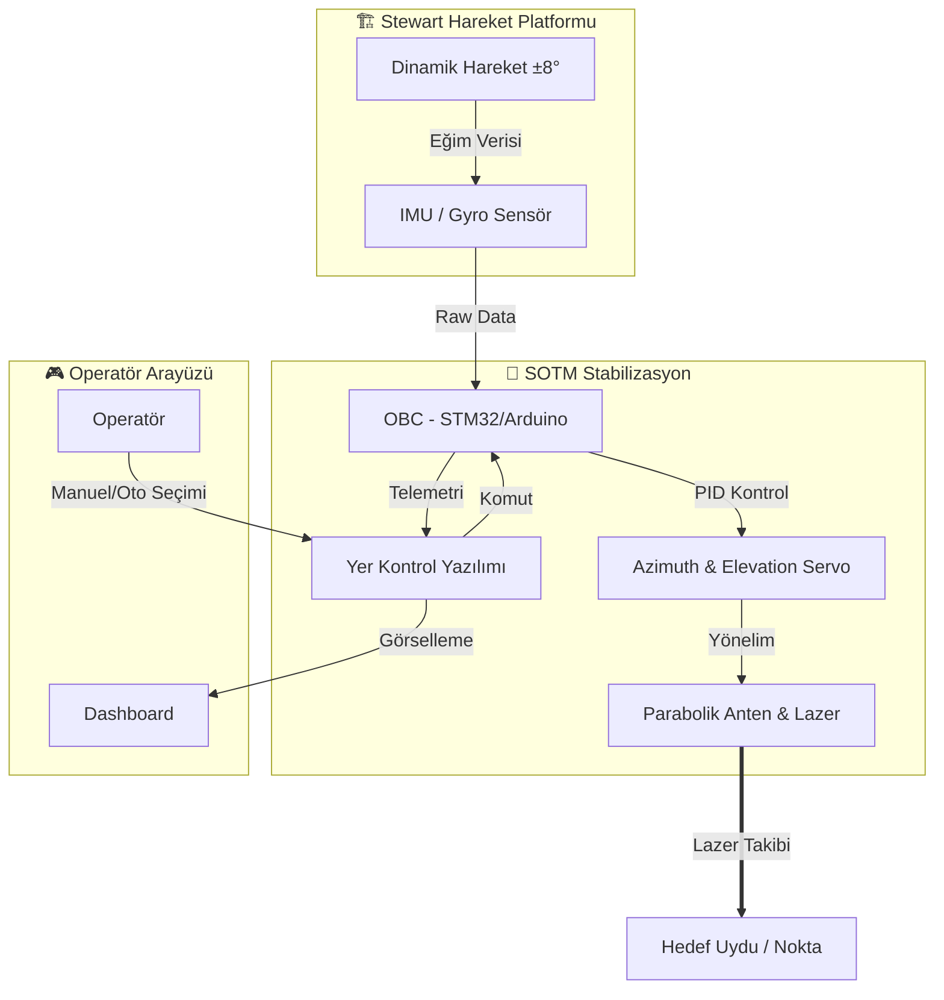

<div align="center">

[](https://github.com/bahattinyunus/teknofest_hareketli_uydu_terminali)

# 🐺 GÖKBÖRÜ MOBİL SİSTEMLER
## 🛰️ Teknofest Hareketli Uydu Terminali Yarışması | 2026


<br>

**"Hareket Halinde Kesintisiz İletişim, Yerli ve Milli Stabilizasyon."**

</div>

---

## � Manifesto | Mission Statement

**GÖKBÖRÜ OTONOM SİSTEMLERİ** olarak vizyonumuz, Milli Teknoloji Hamlesi doğrultusunda ülkemizin uzay ve havacılık alanındaki yetkinliğini artıracak özgün, yerli ve milli çözümler üretmektir.

Bu proje, sadece bir yarışma katılımı değil; otonom sistemler, haberleşme protokolleri ve gömülü yazılım mimarisi üzerine inşa edilmiş **yüksek teknoloji hazırlık seviyesine (TRL-6)** sahip bir Ar-Ge çalışmasıdır.

---

## 🛰️ Sistem Mimarisi | System Architecture

SOTM (Satcom on The Move) sistemimiz, Stewart platformu üzerinde hareket eden bir terminalin, dış etkenlere (Roll/Pitch/Yaw) rağmen uyduya kilitli kalmasını sağlar.



---

## 📊 Teknik Özellikler | Technical Specifications

| Parametre | Değer | Açıklama |
| :--- | :--- | :--- |
| **Terminal Tipi** | SoTM (Satcom on The Move) | Stabilize Uydu Yer Terminali |
| **Hareket Kabiliyeti** | Az: 0-360°, El: 0-90° | Tam Küresel Takip Yeteneği |
| **Stabilizasyon** | Roll/Pitch: ±8° | Stewart Platformu Telafisi |
| **Takip Hassasiyeti** | < 0.5° Error | Dinamik Koşullarda Boresight Kilidi |
| **Ağırlık** | < 20 kg | Tüm bileşenler dahil |
| **Güç Tüketimi** | ≤ 140 W | 5VDC - 36VDC / 220VAC |
| **Yazılım** | Python & C++ | Real-time Kontrol ve GUI |

---

## 🗺️ Operasyonel Konsept | Operational Concept

1.  **Kurulum:** Sistem Stewart platformuna monte edilir ve GPS parametreleri girilir.
2.  **Kalibrasyon:** Gyro/IMU sensörleri sıfırlanır, boresight referans noktası belirlenir.
3.  **Arama/Kilitlenme:** Uydu parametrelerine (Türksat 4B/5A) göre ilk yönelim yapılır (Re-pointing < 8s).
4.  **Stabilizasyon:** Platform hareket etmeye başladığında (±8° Roll/Pitch), kontrol algoritması anteni hedefte sabit tutar.
5.  **Takip:** 5 dakika boyunca kesintisiz olarak lazerin hedef çemberler içinde kalması sağlanır.
6.  **Manuel Müdahale:** Arayüz üzerinden istenilen açı değerlerine anlık geçiş yapılır.

---

## 🛠️ Teknoloji Yığını | Tech Stack

<div align="center">

| Alan | Teknolojiler |
| :--- | :--- |
| **Yazılım Dili** |   |
| **Gömülü Sistem** |   |
| **Arayüz** |   |
| **Veri Analizi** |   |

</div>

---

## 🧮 Mühendislik Araçları | Engineering Tools

Bu repo, görev başarısını garanti altına almak için geliştirilmiş özel simülasyon araçlarını içerir.

### � Anten Yönlendirme (`antenna_pointing.py`)
Yer istasyonu anteninin uyduyu kaçırmaması için anlık Azimuth/Elevation hesaplaması.
```bash
python analysis/calculators/antenna_pointing.py
```

### 📉 İniş Profili Simülasyonu (`descent_profile.py`)
Atmosferik sürüklenme katsayılarına göre iniş süresi tahmini.
```bash
python analysis/simulations/descent_profile.py
```

### 🔗 Link Bütçesi Analizi (`link_budget.py`)
RF sinyal gücünün (RSSI) mesafeye göre değişimi ve Friis denklemi analizi.
```bash
python analysis/calculators/link_budget.py
```

---

## ❓ Sıkça Sorulan Sorular (FAQ)

**S: Neden LoRa teknolojisini tercih ettiniz?**
C: Düşük güç tüketimi ve uzun menzilli haberleşme (Long Range) kapasitesi, model uydu telemetrisi için en optimum çözümdür.

**S: Yer istasyonu yazılımı hangi işletim sistemlerinde çalışır?**
C: Python tabanlı mimarimiz sayesinde Windows, Linux ve macOS üzerinde sorunsuz çalışmaktadır. Cross-platform uyumluluğu tamdır.

**S: Proje açık kaynaklı mı?**
C: Evet, bilginin paylaştıkça çoğaldığına inanıyoruz. MIT lisansı altında tüm kodları inceleyebilir ve katkıda bulunabilirsiniz.

---

## 📂 Dizin Yapısı | Directory Structure

```bash
teknofest_hareketli_uydu_terminali/
├── 📂 analysis/           # 🧪 Simülasyon ve Hesaplamalar
│   ├── calculators/       # Uydu görünürlük ve link hesapları
│   └── simulations/       # Stewart platformu ve takip simülasyonu
├── 📂 src/                # 🧠 Ana Yazılım
│   ├── hardware/          # Motor ve Sensör sürücüleri
│   ├── gui_app.py         # Yer kontrol arayüzü
│   ├── kinematics.py      # Koordinat dönüşüm motoru
│   └── stabilization.py   # PID ve kontrol döngüsü
├── 📂 docs/               # 📚 Teknik Dokümanlar
└── 📄 requirements.txt    # 📦 Bağımlılıklar
```

---

<div align="center">

**GÖKBÖRÜ OTONOM SİSTEMLERİ** &copy; 2024
*"İstikbal Göklerdedir"*

[Bize Ulaşın](mailto:iletisim@gokboru.tech) | [Web Sitesi](https://gokboru.tech)

</div>
