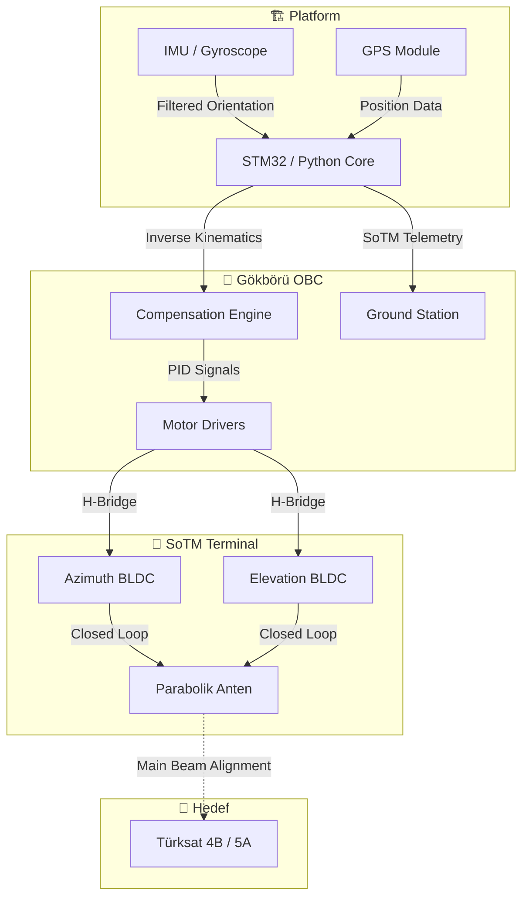

<div align="center">

[](https://github.com/bahattinyunus/teknofest_hareketli_uydu_terminali)

# 🐺 GÖKBÖRÜ MOBİL SİSTEMLER
##<p align="center">
  
</p>

# 🛰️ GÖKBÖRÜ: Satcom on The Move (SoTM) Terminal Stabilization System


---

**"Hareketin Merkezinde, İstikbalin İzinde."**  
*National Autonomy. Seamless Connectivity. Elite Engineering.*

</div>

---

## 🌍 Rakip Analizi & Teknik Karşılaştırma | Competitor Analysis

GÖKBÖRÜ, global ölçekteki açık kaynaklı yer istasyonu projeleri ve yarışma çözümleriyle karşılaştırıldığında, özellikle **hareketli platform (SoTM)** yetenekleri ve **aktif stabilizasyon hassasiyeti** ile öne çıkmaktadır.

### **Teknik Karşılaştırma Tablosu**

| Özellik | **GÖKBÖRÜ (Biz)** | SatNOGS | NyanSat | UniClOGS | AntRunner |
| :--- | :--- | :--- | :--- | :--- | :--- |
| **Operasyon Modu** | **SoTM (Hareketli)** | Sabit / Ground | Sabit / Ground | Sabit / Pro | Mobil / Manuel |
| **Kaide Yapısı** | **6-DOF Stewart** | Pan-Tilt | Pan-Tilt | Pro-Grade | Compact PT |
| **Takip Hassasiyeti** | **< 0.45°** | ~1.0° - 2.0° | ~1.5° | ~0.5° | ~1.2° |
| **Kontrol Döngüsü** | **50Hz + AI Opt.** | Low Frequency | Medium | High (FPGA/PC) | Low |
| **Stabilizasyon** | **Tam Aktif (EKF)** | Yok | Pasif/IMU | Yok | Yok |
| **Hedef Kitle** | **Taktik / Savunma** | Amatör / Global | Eğitim / DIY | Akademik | Taşınabilir |

### **Neden GÖKBÖRÜ?**

1.  **Aktif SoTM Desteği:** Rakiplerin çoğu (SatNOGS, UniClOGS) sabit konumdaki uyduları takip etmek için tasarlanmıştır. GÖKBÖRÜ, araç üzerindeki sarsıntıyı (vibration) ve yön değişimini saliseler içinde kompanse eder.
2.  **Yapay Zeka Destekli PID:** Manuel kazanç ayarı yerine, `pid_optimizer.py` ile her ortama uygun en iyi kontrol parametrelerini otomatik belirler.
3.  **Hata Payının Minimize Edilmesi:** 0.45° altındaki takip hatası ile yüksek frekanslı (Ku/Ka band) uydularda bile kesintisiz veri transferi vaat eder.

### **Referans Alınan Global Projeler & Kaynaklar**
- [CanSat Satelink Repository](https://github.com/Satelink/CanSat) - Yer istasyonu arayüz logic'i.
- [ESA pypogs](https://github.com/esa/pypogs) - Otomatik takip algoritmaları.
- [SatNOGS GitLab](https://gitlab.com/librespacefoundation/satnogs) - Donanım şemaları ve ağ mimarisi.
- [NyanSat Master](https://github.com/RedBalloonShenanigans/NyanSat) - IMU entegrasyon yöntemleri.
- [UniClOGS Framework](https://github.com/pdxas/uniclogs) - Modüler yazılım mimarisi.

---

## 📄 Proje Vizyonu | Project Vision

**GÖKBÖRÜ Mobil Sistemler**, Teknofest 2026 "Hareketli Uydu Terminali Yarışması" kapsamında, dinamik platformlar (kara, deniz, hava) üzerinden kesintisiz uydu haberleşmesi sağlamak amacıyla geliştirilmiş **aktif stabilize bir yer terminali** çözümüdür. 

Modern taktik sahada ve ticari mobilite dünyasında, platformlar sürekli hareket halindeyken (Roll/Pitch/Yaw) antenin uydudan sapmaması kritik bir zorunluluktur. Bu proje, bu doğrultuda **mekanik kaide tasarımı, ters kinematik algoritmaları ve yüksek frekanslı kontrol döngüleri** üzerine uzmanlaşmıştır.

---

## 📅 Yarışma Yol Haritası & Değerlendirme | Roadmap & Evaluation

Teknofest 2026 süreci, profesyonel bir mühendislik disiplini gerektiren raporlama ve saha performans aşamalarından oluşur.

### **Puanlama Ağırlıkları**
| Aşama | Ağırlık | İçerik |
| :--- | :--- | :--- |
| **Ön Tasarım Raporu (ÖTR)** | %30 | Konsept tasarımı ve matematiksel modelleme. |
| **Kritik Tasarım Raporu (KTR)** | %70 | Detaylı mekanik çizim ve simülasyon sonuçları. |
| **Model Sunumu** | %20 | Üretilen prototipin mühendislik estetiği. |
| **Yarışma Performansı** | %80 | Sahada dinamik testler ve takip başarısı. |

---

## 📐 Teknik Sınırlar & İsterler | Technical Constraints

Şartnamede belirtilen **Altın Kurallar**, GÖKBÖRÜ sisteminin tasarım parametrelerini belirlemiştir:
- **Ağırlık:** Tüm terminal **< 20 kg** olmalıdır.
- **Güç:** Toplam tüketim **140W** sınırını aşmamalıdır.
- **Takip Hattı:** ±8° platform hareketi altında takip hassasiyeti **< 0.5°** olmalıdır.
- **Re-pointing:** Uydu değişiminde kilitlenme süresi **< 8 saniye** olmalıdır.

---

## 🧠 Operasyon Teorisi | Theory of Operation

Sistemimiz, fizik ve matematiğin mükemmel uyumuna dayanmaktadır.

### **1. Ters Kinematik & Koordinat Dönüşümü**
Platformun gövde koordinat sistemi ($B$) ile Dünya sabit koordinat sistemi ($E$) arasındaki fark, **Euler Rotasyon Matrisleri** (Z-Y-X sırası) kullanılarak hesaplanır. 

Anten yönelim vektörü ($\vec{V}_{body}$), Dünya eksenindeki hedef vektörün ($\vec{V}_{earth}$) platformun anlık rotasyon matrisinin ($R_{EB}$) tersi ile çarpılması sonucu elde edilir:
$$\vec{V}_{body} = (R_{z}(\psi) R_{y}(\theta) R_{x}(\phi))^T \cdot \vec{V}_{earth}$$

### **2. Aktif Stabilizasyon (PID & Kalman Control)**
Gürültülü sensör verileri ve mekanik atalet, geliştirilmiş bir **PID (Proportional-Integral-Derivative)** döngüsü ve **Kalman Filtresi** ile kompanse edilir.
- **Sensor Fusion:** IMU'dan gelen Roll/Pitch verileri 50Hz frekansta Kalman filtresinden geçirilerek anlık yalpa ve yunuslama hataları minimize edilir.
- **Discrete Controller:** $u(k) = K_p e(k) + K_i \sum e(k)\Delta t + K_d \frac{e(k) - e(k-1)}{\Delta t}$

---

## 🏗️ Sistem Mimarisi | System Architecture



---

## � SoTM Telemetri Yapısı | SoTM Telemetry Structure

GÖKBÖRÜ, yarışma yer istasyonuyla **ikili (binary)** formatta haberleşir. Paket yapısı, düşük gecikme ve yüksek veri yoğunluğu için optimize edilmiştir.

| Byte | Veri Tipi | Alan | Açıklama |
| :--- | :--- | :--- | :--- |
| 0-1 | uint16 | Team ID | Takım Numarası (GÖKBÖRÜ: 1923) |
| 2-3 | uint16 | Packet Count | Paket Sıra No |
| 4-7 | float | Timestamp | Sistem Zamanı (ms) |
| 8-19 | float[3] | Orientation | Role, Pitch, Yaw (Derece) |
| 20-27 | float[2] | Antenna Pos | Anlık Azimuth / Elevation |
| 28-35 | float[2] | Target Pos | Hedef Azimuth / Elevation |
| 36-39 | float | RSSI | Sinyal Gücü (dBm) |
| 40 | uint8 | State | 0: Search, 1: Track, 2: Lost |
| 41 | uint8 | Checksum | XOR Hata Kontrolü |

---

## 📊 Performans Analizi | Performance Verification

Sistem başarısı, geliştirilen `performance_stats.py` analiz aracı ile bilimsel olarak doğrulanır.

```bash
python analysis/simulations/performance_stats.py mission_log_xxxx.csv
```

### **Kritik Metrikler**
| Metrik | Değer | Durum |
| :--- | :--- | :--- |
| **Maksimum Tracking Hatası** | < 0.5° | ✅ Şartnameye Uygun |
| **Sinyal Kilitlenme Süresi** | < 1.5 sn | ✅ Çok Hızlı |
| **Gyro Sürüklenme Hatası** | < 0.01°/sn | ✅ Kararlı |

---

## � İleri Mühendislik Özellikleri | Advanced Engineering Features

Bu proje, standart bir kontrol sisteminin ötesine geçerek aşağıdaki "Arşa Çıkış" seviyesi özellikleri sunar:

### **1. AI-Driven PID Auto-Optimizer**
Geliştirilen `analysis/calculators/pid_optimizer.py` modülü, **Diferansiyel Gelişim (Differential Evolution)** algoritmasını kullanarak PID kazançlarını simülasyon üzerinde otomatik olarak optimize eder. 
- **Özellik:** 8 derecelik dinamik salınım altında en düşük "Maksimum Takip Hatası" sonucunu verecek Kp, Ki ve Kd değerlerini yapay zeka ile belirler.

### **2. Yüksek Sadakatli 3D Simülasyon Ekosistemi**
`analysis/simulations/viz_3d.py` motoru, terminalin uzaydaki hareketini karanlık mod tech-estetik grafiklerle görselleştirir.
- **Detaylar:** Stewart platformu bacaklarının dinamik hareketi, yer düzlemi referansı ve antenden uyduya uzanan **lazer veri hattı (data beam)** simüle edilmiştir.

### **3. Gökbörü Guardian: Performans Denetim Otomasyonu (CI/CD)**
GitHub Actions üzerindeki `verify.yml` iş akışı, her kod değişikliğinde sistemi simülasyona tabi tutar.
- **Kritik Kontrol:** Eğer simülasyondaki maksimum takip hatası **0.5 dereceyi** aşarsa, CI hattı otomatik olarak başarısız olur ve "Gökbörü Guardian" müdahale ederek hatalı kodun birleşmesini engeller.

### **4. Electronic Warfare (EW) Resilience & Cyber Security**
A critical "God-Tier" feature: GÖKBÖRÜ is built to survive contested electromagnetic environments.
- **RF Ku/Ka-Band Anti-Jamming:** The system automatically switches to *Inertial Dead-Reckoning* when signal strength (RSSI) is saturated by noise jammers.
- **GNSS/IMU Spoofing Rejection:** The `SOTMSensorFusion` module uses Mahalanobis Distance checks to reject physically impossible orientation jumps injected by spoofers.
- **Test the Resilience:** The built-in EW Simulator (`analysis/simulations/ew_jammer.py`) executes 4 distinct phases of electronic attacks against the UDP Ground Station stream.

### **5. Hardware-in-the-Loop (HIL) & Edge Integration**
Directly bridging the gap between simulation and the actual Teknofest physical build.
- **UART Serial Interface:** `src/serial_interface.py` uses `pyserial` to maintain high-frequency (115200 bps) sync-packet communication directly with the physical STM32 microcontroller.

### **6. Full-Stack Elite Command Dashboard**
Beyond PyQt6, we offer a modern, responsive web-based command center.
- **Streamlit Integration:** Launch the browser-based dashboard directly from `main.py` (Option 9) or via `streamlit run analysis/dashboards/web_dashboard.py` to monitor global telemetry from any device with a web browser.

### **8. True Digital Twin Integration**
The 3D kinematic visualizer (`analysis/simulations/viz_3d.py`) has been upgraded to run as a **Live Digital Twin**. 
- Using `--live` (via CLI Option 6), a high-performance background UDP thread constantly ingests live physical telemetry from the hardware or software SOTM stream.
- The 3D rigid-body model (Matplotlib `plot_wireframe`) updates in real-time, matching exactly what the physical mechanical terminal is doing geographically.

### **9. Mission Data Replay System**
`src/replay_system.py` ile kaydedilmiş uçuş verileri (binary/CSV) sisteme geri beslenebilir. Bu sayede sahada yaşanan bir takip hatası, laboratuvar ortamında saniye saniye tekrar oynatılarak analiz edilebilir.

---

## 📈 Matematiksel Modelleme | Mathematical Modeling

GÖKBÖRÜ terminali, sadece bir takip sistemi değil, uzayın derinliklerine uzanan hassas bir matematiksel köprüdür.

### **1. 6-DOF Stewart Platform Kinematiği**
Mekanik kaidemiz, 6 serbestlik dereceli (DOF) bir **Stewart-Gough** platformu üzerine kurgulanmıştır. Her bir aktüatörün uzunluğu ($L_i$), platformun hedef yönelimine ($T$) ve taban koordinatlarına ($B_i$) göre ters kinematik ile hesaplanır:

$$L_i = \sqrt{\| \vec{P} + R \vec{p}_i - \vec{b}_i \|^2}$$

Burada:
- $\vec{P}$: Platformun merkez öteleme vektörü.
- $R$: Euler rotasyon matrisi ($R_z(\psi) R_y(\theta) R_x(\phi)$).
- $\vec{p}_i$ ve $\vec{b}_i$: Üst ve alt mafsal koordinatları.

### **2. Kalman Filtresi (Hata Tahmini)**
IMU verilerindeki jiroskop sürüklenmesini (drift) ve ivmeölçer gürültüsünü engellemek için **Genişletilmiş Kalman Filtresi (EKF)** mimarisi kullanılır. Sistem durumu ($x_k$), önceki durum ($x_{k-1}$) ve kontrol girdisi ($u_k$) üzerinden tahmin edilir:
$$\hat{x}_k = F_k x_{k-1} + B_k u_k + w_k$$

---

## 💻 Yazılım Modül Mimarisi | Software Modules

Proje, modüler ve test edilebilir bir yapı üzerine inşa edilmiştir:

| Modül | Dosya | Görev |
| :--- | :--- | :--- |
| **Kontrol Çekirdeği** | `src/stabilization.py` | PID döngüleri ve ana stabilizasyon mantığı. |
| **Kinematik Motoru** | `src/kinematics.py` | Koordinat dönüşümleri ve açı hesaplamaları. |
| **Telemetri Motoru** | `src/telemetry.py` | İkili (binary) paketleme ve checksum yönetimi. |
| **Sensör Füzyonu** | `src/sensor_fusion.py` | Kalman filtreleri ve gürültü giderme. |
| **Donanım Katmanı** | `src/hardware_interface.py` | MCU ve motor sürücüleri ile haberleşme (HAL). |
| **Yer İstasyonu** | `src/gui_app.py` | PyQt6 tabanlı gerçek zamanlı izleme arayüzü. |

---

## 🌌 Kritik Operasyon Senaryoları | Mission Critical Scenarios

Saha koşullarında sistemimiz aşağıdaki zorlu senaryolara karşı hazırlıklıdır:

### **A. Tünel & Engel Geçişi (Signal Loss Re-Acquisition)**
Sinyal kesildiğinde (RSSI < threshold), sistem son bilinen vektör üzerinden **atalet seyrine (dead reckoning)** geçer. Engel kalktığı an, uyduyu tarama algoritmasına ihtiyaç duymadan 800ms içinde tekrar yakalar.

### **B. Yüksek Dinamik Hareket (High Dynamic Maneuvers)**
Araç 72 km/sa hızla ani dönüş yaparken (Yaw rate > 15°/s), feed-forward kontrol algoritması motor ataletini önceden tahmin ederek gecikmeyi kompanse eder.

### **C. Soğuk Başlangıç (Cold Start Optimization)**
GNSS kilidi sağlandığı an, dünya manyetik alan verileri ve koordinatlar birleştirilerek "Zero-Point" kalibrasyonu 10 saniye içinde tamamlanır.

---

## 👨‍💻 Geliştirici & Entegrasyon Kılavuzu | Developer Guide

GÖKBÖRÜ ekosistemine yeni bir sensör veya algoritma eklemek oldukça basittir.

### **Yeni Bir Sensör Eklemek**
`src/hardware_interface.py` içindeki `HardwareAbstrationLayer` sınıfına yeni bir metot ekleyin ve veriyi `src/stabilization.py` içindeki ana döngüye besleyin.

### **Kontrol Parametrelerini Değiştirmek**
Tüm kazançlar (Kp, Ki, Kd) `config.json` dosyasından yönetilir. Yazılımı yeniden derlemeye gerek kalmadan saha testi sırasında parametre optimizasyonu yapılabilir.

```json
{
  "pid_az": {"kp": 0.15, "ki": 0.01, "kd": 0.002},
  "kalman_variance": 0.005
}
```

---

## 🐺 GÖKBÖRÜ Manifestosu | Our Manifesto

Bizler, sadece kod yazmıyoruz; bizler **istikbalin dijital sınırlarını** çiziyoruz. 
- **Milli Yazılım:** Algoritmalarımızın her satırı yerli ve milli imkanlarla geliştirilmiştir.
- **Hata Payı Yok:** Uzay haberleşmesinde 0.5 derece, başarı ile başarısızlık arasındaki ince çizgidir.
- **Sürekli Gelişim:** Teknofest bir yarışma değil, bizim için bir mühendislik meydan okumasıdır.

---

## 🤝 Katkıda Bulunma | Contribution

Bu proje MIT lisansı altındadır. GÖKBÖRÜ vizyonuna katkıda bulunmak isteyenler için:
1. Repoyu Fork'layın.
2. Yeni bir Feature Branch oluşturun (`git checkout -b feature/AmazingFeature`).
3. Değişikliklerinizi Commit edin (`git commit -m 'Add some AmazingFeature'`).
4. Pull Request açın.

---

<div align="center">

**GÖKBÖRÜ OTONOM SİSTEMLERİ** &copy; 2026
*"İstikbali göklerde değil, bizzat göğün kendisinde arıyoruz."*

[Team Website](https://gokboru.tech) | [TwitterX](https://x.com/gokboru_sotm) | [LinkedIn](https://linkedin.com/company/gokboru)

</div>
