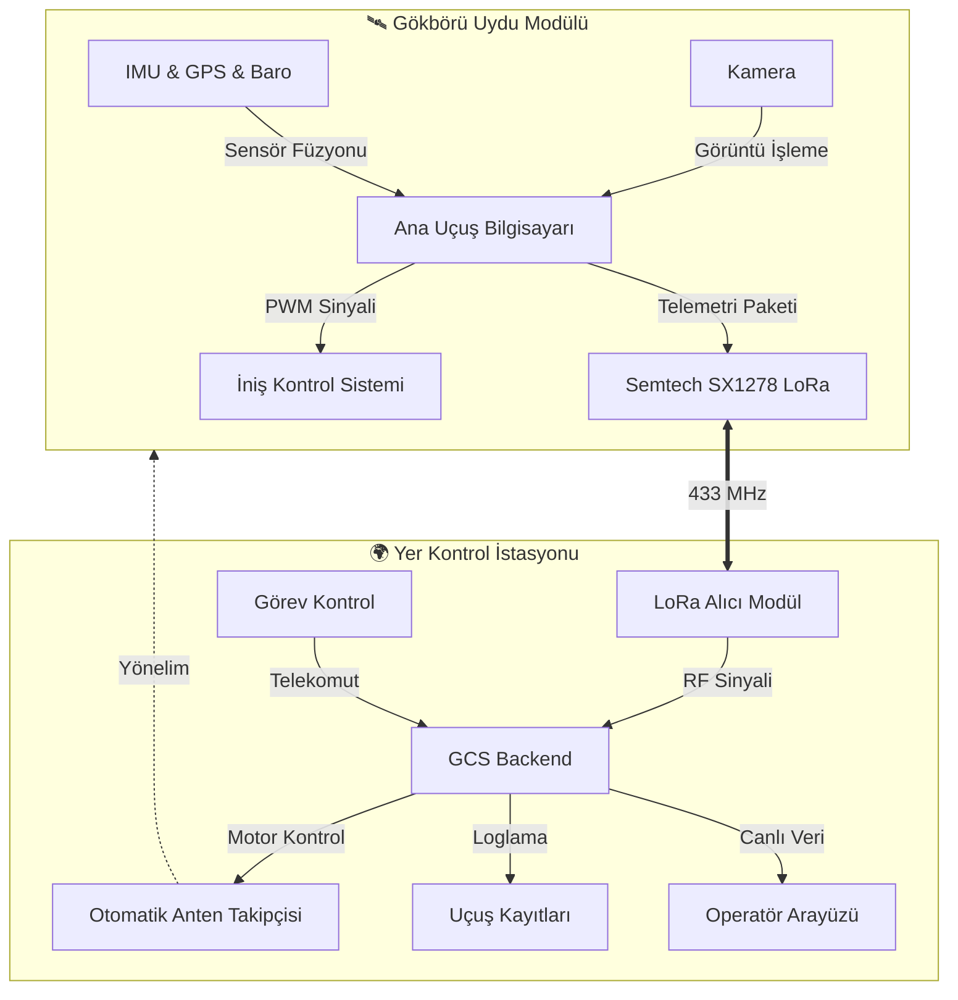

<div align="center">

[](https://github.com/bahattinyunus/teknofest_hareketli_uydu_terminali)

# 🐺 GÖKBÖRÜ OTONOM SİSTEMLERİ
## 🛰️ Teknofest Model Uydu Yarışması | 2024 Finalist


<br>

**"Göklerde İstikbal, Kodlarda İstiklal."**

</div>

---

## � Manifesto | Mission Statement

**GÖKBÖRÜ OTONOM SİSTEMLERİ** olarak vizyonumuz, Milli Teknoloji Hamlesi doğrultusunda ülkemizin uzay ve havacılık alanındaki yetkinliğini artıracak özgün, yerli ve milli çözümler üretmektir.

Bu proje, sadece bir yarışma katılımı değil; otonom sistemler, haberleşme protokolleri ve gömülü yazılım mimarisi üzerine inşa edilmiş **yüksek teknoloji hazırlık seviyesine (TRL-6)** sahip bir Ar-Ge çalışmasıdır.

---

## 🏗️ Sistem Mimarisi | System Architecture

Model uydumuz ve yer istasyonumuz arasındaki haberleşme ve kontrol döngüsü, endüstriyel standartlarda tasarlanmıştır.



---

## 📊 Teknik Özellikler | Technical Specifications

Sistemimiz zorlu görev şartlarına dayanacak şekilde optimize edilmiştir.

| Parametre | Değer | Açıklama |
| :--- | :--- | :--- |
| **Haberleşme Menzili** | 10+ km | Line-of-Sight (LoRa spread factor 12) |
| **Veri Hızı** | 115200 baud | Yer istasyonu seri haberleşme hızı |
| **Paket Güncelleme** | 4 Hz | Saniyede 4 telemetri paketi |
| **İniş Hızı** | 4-6 m/s | Kontrollü paraşüt açılma sonrası |
| **İşlemci** | ARM Cortex-M4 | STM32 Flight Controller |
| **Yer Yazılımı** | Python 3.11 | Asenkron mimari (AsyncIO) |

---

## 🗺️ Operasyonel Konsept | Operational Concept

1.  **Fırlatma Öncesi (Pre-Launch):** Sistem başlatılır, sensör kalibrasyonları yapılır ve yer istasyonu ile "Handshake"  gerçekleşir.
2.  **Yükselme (Ascent):** Roket ile 700m irtifaya çıkış. Sistem "Uyku Modu"nda bekler.
3.  **Ayrılma (Separation):** Roketten ayrılma algılanır, serbest düşüş başlar.
4.  **Görev Yükü (Payload Release):** 400m irtifada taşıyıcıdan ayrılma ve ana paraşüt açılımı.
5.  **İniş (Descent):** Kontrollü iniş sırasında canlı video ve telemetri aktarımı.
6.  **Kurtarma (Recovery):** GPS koordinatlarına göre enkazın bulunması.

---

## 🛠️ Teknoloji Yığını | Tech Stack

<div align="center">

| Alan | Teknolojiler |
| :--- | :--- |
| **Yazılım Dili** |   |
| **Gömülü Sistem** |   |
| **Arayüz** |   |
| **Veri Analizi** |   |

</div>

---

## 🧮 Mühendislik Araçları | Engineering Tools

Bu repo, görev başarısını garanti altına almak için geliştirilmiş özel simülasyon araçlarını içerir.

### � Anten Yönlendirme (`antenna_pointing.py`)
Yer istasyonu anteninin uyduyu kaçırmaması için anlık Azimuth/Elevation hesaplaması.
```bash
python analysis/calculators/antenna_pointing.py
```

### 📉 İniş Profili Simülasyonu (`descent_profile.py`)
Atmosferik sürüklenme katsayılarına göre iniş süresi tahmini.
```bash
python analysis/simulations/descent_profile.py
```

### 🔗 Link Bütçesi Analizi (`link_budget.py`)
RF sinyal gücünün (RSSI) mesafeye göre değişimi ve Friis denklemi analizi.
```bash
python analysis/calculators/link_budget.py
```

---

## ❓ Sıkça Sorulan Sorular (FAQ)

**S: Neden LoRa teknolojisini tercih ettiniz?**
C: Düşük güç tüketimi ve uzun menzilli haberleşme (Long Range) kapasitesi, model uydu telemetrisi için en optimum çözümdür.

**S: Yer istasyonu yazılımı hangi işletim sistemlerinde çalışır?**
C: Python tabanlı mimarimiz sayesinde Windows, Linux ve macOS üzerinde sorunsuz çalışmaktadır. Cross-platform uyumluluğu tamdır.

**S: Proje açık kaynaklı mı?**
C: Evet, bilginin paylaştıkça çoğaldığına inanıyoruz. MIT lisansı altında tüm kodları inceleyebilir ve katkıda bulunabilirsiniz.

---

## 📂 Dizin Yapısı | Directory Structure

```bash
teknofest_hareketli_uydu_terminali/
├── 📂 analysis/           # 🧪 Simülasyon ve Analiz
│   ├── calculators/       # Mühendislik hesaplayıcıları
│   └── simulations/       # Fizik motoru simülasyonları
├── 📂 src/                # 🧠 Ana Yazılım
│   ├── ground_station.py  # Yer istasyonu çekirdeği
│   └── telemetry.py       # Protokol ayrıştırıcı
├── 📂 docs/               # 📚 Teknik Dokümanlar
└── 📄 requirements.txt    # 📦 Proje Gereksinimleri
```

---

<div align="center">

**GÖKBÖRÜ OTONOM SİSTEMLERİ** &copy; 2024
*"İstikbal Göklerdedir"*

[Bize Ulaşın](mailto:iletisim@gokboru.tech) | [Web Sitesi](https://gokboru.tech)

</div>
